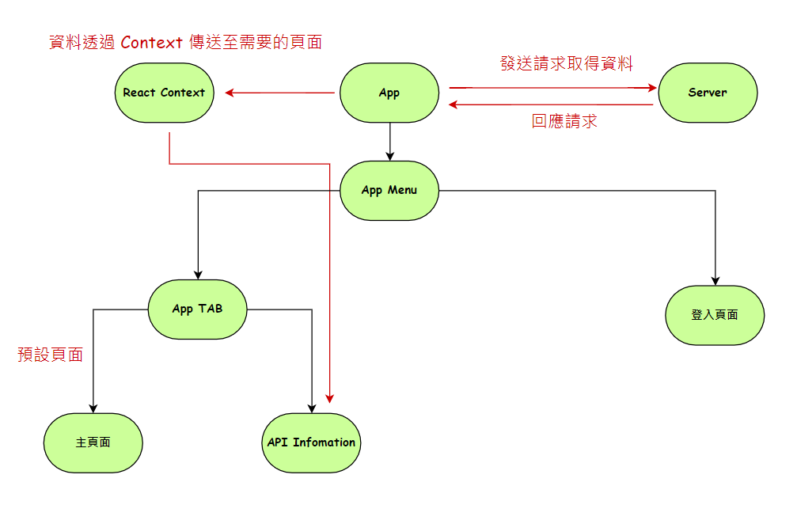

## Awesome Project
123
---

### 系統架構

- React 版本 : 17
- ReactNative 版本 : 0.66.3
- App Menu : 使用 React-Navigation/Drawer 建置
- App Tab : 使用 React-Navigation/Bottom-Tabs 建置
- CSS : Styled-Components/native
- Icon : React-Native-Vector-Icon
- 狀態管理 : React-Cotext

---

### 施作時間

- React CLI 環境設置 約 30 分鐘
- 設置 App Bottom Tab 約一小時半
- 設置 App Menu 約一小時
- 串接 API 約 10 分鐘

---

### 上架流程

#### Android

######  1.事前準備

- 申請 Google Play Console 帳號
- 程式 Icon
- 主視覺圖 \* 1
- 說明文搞(說明內容會影響 Google 關鍵字搜尋)
- 手機截圖 \* 2

######  2.設定 App Signing

- 至 Google Play Console 選擇 "應用程式簽署"
- 選擇 " 應用程式版本 "
- 選擇 " 內部測試群組 "
- 選擇 " 建立新版本 "
- 選擇 " 使用 Google Play 應用程式簽署 "
- 選擇 " 同意 " 取得 App Signing Key

######  3.建立 Keystore

- 開啟 Android Studio，點選「Build > Generated Signed APK」：
- 點選「Next」
- 點選「Create New…」
- 填入 Keystore 資訊：

  - Keystore
    Key store path: 存在專案目錄底下的 android/app/my-release-key.keystore。
    Password: keystore 的密碼

    --

  - Key
    Alias: my-key-alias
    Password: key 的密碼
    Validity (years): 25
    Certificate: 公司或是個人開發者的資訊

######  4.設定 Release Config

- 編輯專案目錄底下的 android/gradle.properties，把星號處換成上一步設定的密碼:
- 在 Gradle Config 中新增 Signing Config
  - 編輯 app/build.gradle

######  5.產生簽署過的 APK 檔

- 編輯 app/build.gradle，修改 applicationId、versionCode 及 versionName
- 執行 build script
  - $ cd android
  - $ ./gradlew assembleRelease

######  6.上傳 APK

- 到 Google Play Console 裡，點選「版本管理 > 應用程式版本」
- 選擇群組，點選『管理」。在測試階段，就選「內部測試群組」。如果要正式上架，就選「正式版測試群組」：
- 選擇「瀏覽檔案」：
- 填寫 Release Note，按「審核」：
- 上傳完成後保存 Upload Key (未來更新時需使用)

#### IOS
不確定
- 
---
